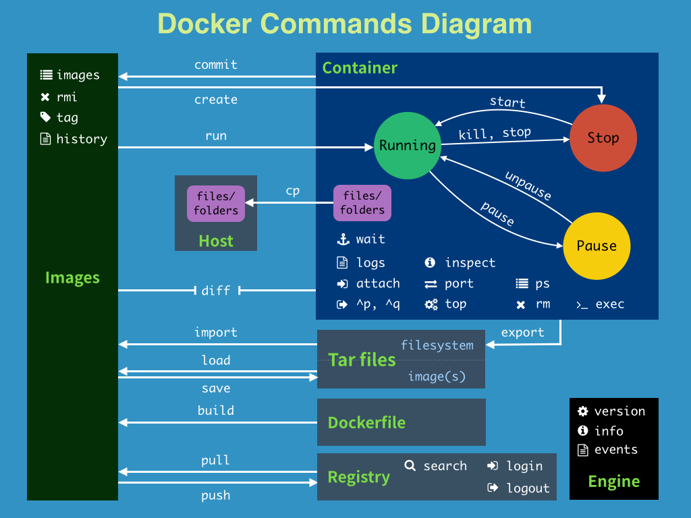
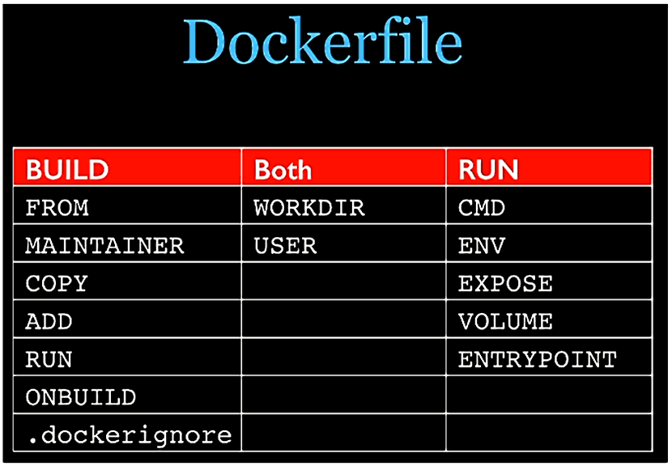

# Docker

## 1. Docker 基础

### 1.1 基本组成

- **镜像（image）**：只读的模板，镜像可以用来创建 Docker 容器，一个镜像可以创建很多容器
- **容器（container）**：类似于一个虚拟化的运行环境，容器是用镜像创建的运行实例
- **仓库（repository）**：集中存放镜像文件的场所

### 1.2 工作原理

​		**Docker** 是一个 **Client-Server** 结构的系统，Docker 以 **守护进程** 运行在主机上， 然后通过 **Socket 连接** 从客户端访问，守护进程从客户端接受命令并管理运行在主机上的容器。 

### 1.3 命令总览

### 1.4 帮助启动类命令

**启动 docker**：`systemctl start docker`

**开机启动**：`systemctl enable docker`

**停止 docker**：`systemctl stop docker`

**重启 docker**：`systemctl restart docker`

**查看 docker 状态**：`systemctl status docker`

**查看 docker 概要信息**：`docker info`

**查看 docker 总体帮助文档**：`docker --help`

**查看 docker 命令帮助文档**：`docker command --help`

### 1.5 镜像命令

| Command                | Description                                                  |
| :--------------------- | :----------------------------------------------------------- |
| `docker image history` | Show the history of an image                                 |
| `docker image import`  | Import the contents from a tarball to create a filesystem image |
| `docker image inspect` | Display detailed information on one or more images           |
| `docker image load`    | Load an image from a tar archive or STDIN                    |
| `docker image ls`      | List images                                                  |
| `docker image prune`   | Remove unused images                                         |
| `docker image pull`    | Download an image from a registry                            |
| `docker image push`    | Upload an image to a registry                                |
| `docker image rm`      | Remove one or more images                                    |
| `docker image save`    | Save one or more images to a tar archive (streamed to STDOUT by default) |
| `docker image tag`     | Create a tag TARGET_IMAGE that refers to SOURCE_IMAGE        |

**列出本地镜像**：`docker images`，（-a，列出本地所有的镜像，-q，只显示镜像ID ）

**查找镜像**：`docker search image-name`，（--limit N，列出 N 个镜像）

**下载镜像**：`docker pull image-name:TAG`，（无 TAG 默认下载 latest）

**删除镜像**：`docker rmi image-id`，`docker rmi image-name1:TAG image-name2:TAG`，`docker rmi $(docker images -qa)`，（-f 强制删除）

**查看镜像/容器/数据卷所占空间**：`docker system df`

**提交镜像**：`docker commit [OPTIONS] CONTAINER [REPOSITORY[:TAG]]`

**上传镜像**：`docker push [OPTIONS] NAME[:TAG]`

### 1.6 容器命令

| Command                    | Description                                                  |
| :------------------------- | :----------------------------------------------------------- |
| `docker container attach`  | Attach local standard input, output, and error streams to a running container |
| `docker container commit`  | Create a new image from a container's changes                |
| `docker container cp`      | Copy files/folders between a container and the local filesystem |
| `docker container create`  | Create a new container                                       |
| `docker container diff`    | Inspect changes to files or directories on a container's filesystem |
| `docker container exec`    | Execute a command in a running container                     |
| `docker container export`  | Export a container's filesystem as a tar archive             |
| `docker container inspect` | Display detailed information on one or more containers       |
| `docker container kill`    | Kill one or more running containers                          |
| `docker container logs`    | Fetch the logs of a container                                |
| `docker container ls`      | List containers                                              |
| `docker container pause`   | Pause all processes within one or more containers            |
| `docker container port`    | List port mappings or a specific mapping for the container   |
| `docker container prune`   | Remove all stopped containers                                |
| `docker container rename`  | Rename a container                                           |
| `docker container restart` | Restart one or more containers                               |
| `docker container rm`      | Remove one or more containers                                |
| `docker container run`     | Create and run a new container from an image                 |
| `docker container start`   | Start one or more stopped containers                         |
| `docker container stats`   | Display a live stream of container(s) resource usage statistics |
| `docker container stop`    | Stop one or more running containers                          |
| `docker container top`     | Display the running processes of a container                 |
| `docker container unpause` | Unpause all processes within one or more containers          |
| `docker container update`  | Update configuration of one or more containers               |
| `docker container wait`    | Block until one or more containers stop, then print their exit codes |

**列出当前运行的容器**：`docker ps [OPTIONS]`，（-a，列出当前所有正在运行的容器 + 历史上运行过的容器，-l，显示最近创建的容器，-n，显示最近 n 个创建的容器，-q，静默模式，只显示容器编号）

**创建并启动容器**：`docker run [OPTIONS] IMAGE [COMMAND] [ARG...]`，（-d，后台运行容器并返回容器ID，-i，以交互模式运行容器，-t，为容器重新分配一个伪输入终端，-P，随机端口映射，-p，指定端口映射）

**启动容器**：`docker start container-id/container-name`

**重启容器**：`docker restart container-id/container-name`

**进入正在运行的容器**：

- `docker exec -it container-id`：在容器中打开新的终端，并且可以启动新的进程，用 exit 退出，不会导致容器的停止
- `docker attach container-id`：直接进入容器启动命令的终端，不会启动新的进程，用 exit 退出，会导致容器的停止

**退出容器**：

- `exit`：exit 退出，容器停止
- `ctrl + p + q`：容器不停止

**停止容器**：

- 停止容器：`docker stop container-id/container-name`
- 强制停止容器：`docker kill container-id/container-name`

**删除容器**：

- 删除单个：`docker rm container-id`
- 删除多个：`docker rm -f $(docker ps -a -q)`；`docker ps -a -q | xargs docker rm`

**容器日志**：`docker logs container-id`

**容器进程**：`docker top container-id`

**容器细节**：`docker inspect container-id`

**容器拷贝文件到主机**：`docker cp container-id:容器路径 主机路径`

**主机拷贝文件到容器**：`docker cp 主机路径 container-id:容器路径`

### 1.7 数据卷

​		数据卷是一个可供一个或多个容器使用的特殊目录，它绕过 UnionFS，在容器之间共享和重用，对数据卷的修改会立马生效，对数据卷的更新，不会影响镜像，数据卷默认会一直存在，即使容器被删除。

| Command                 | Description                                         |
| :---------------------- | :-------------------------------------------------- |
| `docker volume create`  | Create a volume                                     |
| `docker volume inspect` | Display detailed information on one or more volumes |
| `docker volume ls`      | List volumes                                        |
| `docker volume prune`   | Remove unused local volumes                         |
| `docker volume rm`      | Remove one or more volumes                          |
| `docker volume update`  | Update a volume (cluster volumes only)              |

- **添加容器卷**：`-v [宿主机路径或卷名]:[容器内路径]`

- **读写规则映射添加**：`-v [宿主机路径或卷名]:[容器内路径]:[rw|ro]`（读写/只读，默认读写）

- **卷的继承和共享**：`--volumes-from <容器名或ID>`

[注] 不使用目录以名称开头会识别为数据卷而非本地目录，什么都不指定创建匿名数据卷

### 1.8 Dockerfile

#### 1.8.1 保留字指令

- **FROM**：基础镜像，当前新镜像是基于哪个镜像的，指定一个已经存在的镜像作为模板，第一条必须是 `FROM`
- **MAINTAINER**：镜像维护者的姓名和邮箱地址
- **ADD**：将宿主机目录下的文件拷贝进镜像且会自动处理 `URL` 和 解压 `tar` 压缩包

  - `ADD [--chown=<user>:<group>] [--chmod=<perms>] [--checksum=<checksum>] <src>... <dest>`
  - `ADD [--chown=<user>:<group>] [--chmod=<perms>] ["<src>",... "<dest>"]`
- **COPY**：拷贝文件和目录到镜像中，从构建上下文目录（docker build 所在路径）中源路径的文件/目录复制目标路径位置

  - `COPY [--chown=<user>:<group>] [--chmod=<perms>] <src>... <dest>`

  - `COPY [--chown=<user>:<group>] [--chmod=<perms>] ["<src>",... "<dest>"]`
- **RUN**：容器构建时需要运行的命令

  - shell 格式：`RUN <命令行命令>`
  - exec 格式：`RUN ["可执行文件", "参数1", "参数2"]`

---

- **WORKDIR**：指定在创建容器后，终端默认登录进来的工作目录

- **USER**：指定该镜像以什么样的用户去执行，不指定默认是 `root`

---

- **CMD**：指定容器启动后运行的命令。如果有多个 `CMD` 指令，只有最后一个生效。
  - shell 格式：`CMD command param1 param2` 
  - exec 格式：`CMD ["executable","param1","param2"]`
  - 作为 `ENTRYPOINT` 默认参数，exec格式：`CMD ["param1","param2"]`
- **ENV**：用来在构建镜像过程中设置环境变量
- **EXPOSE**：当前容器对外暴露出的端口

- **VOLUME**：容器数据卷，用于数据保存和持久化
- **ENTRYPOINT**：类似 `CMD` 命令，但是 `ENTRYPOINT` 不会被 `docker run` 后面的命令覆盖，这些命令行参数会被当做参数传递给 `ENTRYPOINT` 指令指定的程序（即相当于 ENTRYPOINT 和 CMD 并用，CMD 给 ENTRYPOINT 传参）。如果有多个 `ENTRYPOINT` 指令，只有最后一个生效。
  - shell格式：`ENTRYPOINT command param1 param2`
  - exec 格式：`ENTRYPOINT ["executable", "param1", "param2"]`

#### 1.8.2 保留字运行时机

## 2. Docker 网络

### 2.1 基本命令

| Command                     | Description                                          |
| :-------------------------- | :--------------------------------------------------- |
| `docker network connect`    | Connect a container to a network                     |
| `docker network create`     | Create a network                                     |
| `docker network disconnect` | Disconnect a container from a network                |
| `docker network inspect`    | Display detailed information on one or more networks |
| `docker network ls`         | List networks                                        |
| `docker network prune`      | Remove all unused networks                           |
| `docker network rm`         | Remove one or more networks                          |

### 2.2 网络模式

**bridge mode**：使用 `--network bridge` 指定，默认使用 `docker0`

​		Docker 服务默认会创建一个 docker0 网桥（其上有一个 docker0 内部接口），该桥接网络的名称为docker0，它在内核层连通了其他的物理或虚拟网卡，这就将所有容器和本地主机都放到同一个物理网络。Docker 默认指定了 docker0 接口 的 IP 地址和子网掩码，让主机和容器之间可以通过网桥相互通信。（网桥的 **veth** 接口连接容器的 **eth0** 网卡）

**host mode**：使用 `--network host` 指定

​		容器将不会获得一个独立的 Network Namespace， 而是和宿主机共用一个 Network Namespace。容器将不会虚拟出自己的网卡而是使用宿主机的IP和端口。

**none mode**：使用 `--network none` 指定

​		禁用网络功能，只有 lo 标识（即127.0.0.1 表示本地回环）

**container mode**：使用 `--network container:container-name / container:container-id` 指定

​		新建的容器和已经存在的一个容器共享一个网络ip配置而不是和宿主机共享。新创建的容器不会创建自己的网卡，配置自己的IP，而是和一个指定的容器共享IP、端口范围等。同样，两个容器除了网络方面，其他的如文件系统、进程列表等还是隔离的。

## 3. Docker Compose

### 3.1 常用命令

|                 cmd                 |                      func                      |
| :---------------------------------: | :--------------------------------------------: |
|          docker-compose -h          |                    查看帮助                    |
|        docker-compose up -d         |     （-d 后台）启动所有docker-compose服务      |
|         docker-compose down         |         停止并删除容器、网络、卷、镜像         |
|       docker-compose restart        |                    重启服务                    |
|        docker-compose start         |                    启动服务                    |
|         docker-compose stop         |                    停止服务                    |
|          docker-compose ps          | 展示当前 docker-compose 编排过的运行的所有容器 |
|         docker-compose top          |    展示当前 docker-compose 编排过的容器进程    |
|        docker-compose config        |                    检查配置                    |
| docker-compose exec yml里面的服务id |                进入容器实例内部                |
| docker-compose logs yml里面的服务id |                查看容器输出日志                |

## 4. Docker 容器监控

- **CAdvisor**：容器资源监控工具,包括容器的内存,CPU,网络IO,磁盘IO等监控,同时提供了一个WEB页面用于查看容器的实时运行状态。
- **InfluxDB**：InfluxDB是一个时序数据库，专门用于存储时序相关数据，很适合存储CAdvisor的数据。
- **Granfana**：数据监控分析可视化平台,支持多种数据源配置和丰富的插件及模板功能,支持图表权限控制和报警。

**协调工作**：CAdvisor 负责收集容器的随时间变化的数据，InfluxDB 负责存储时序数据，Grafana 负责分析和展示时序数据。