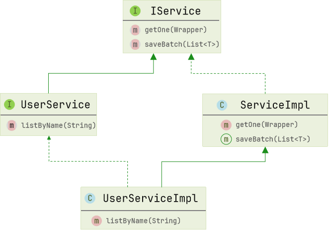

# MyBatisPlus

## 1. MP 配置

### 1.1 Mapper

```java
public interface xxxMapper extends BaseMapper<T> {} // 解析泛型
```

MyBatisPlus 通过扫描实体类，并基于反射获取实体类信息作为数据库表信息，默认情况

- 类名驼峰转下划线作为表名
- 名为 id 的字段作为主键
- 变量名驼峰转下划线作为表的字段名

### 1.2 常用注解

#### 1.2.1 @TableName 指定表名

#### 1.2.2 @TableId 指定主键字段

`IdType` 常见类型：`AUTO`、`INPUT`、`ASSIGN_ID`

#### 1.2.3 @TableField 指定普通字段

常见使用场景：

- 成员变量名与数据库字段名不一致
- 成员变量名以 is 开头，且是布尔值（默认转换会把 is 去掉，而非驼峰转下划线）
- 成员变量名与数据库关键字冲突
- 成员变量名不是数据库字段，设置 `exist = false`

### 1.3 常见配置

```yaml
mybatis-plus:
	type-aliases-package: com.demo.po # 别名扫描包
	mapper-locations: "classpath*:/mapper/**/*.xml" # Mapper.xml 文件地址，默认值
	configuration:
		map-underscore-to-camel-case: true # 是否开启下划线和驼峰映射
		cache-enabled: false # 是否开启二级缓存
	global-config:
		db-config:
			id-type: assign_id # id 为雪花算法生成
			update-strategy: not_null # 更新策略: 只更新非空字段
```

## 2. 核心功能

### 2.1 条件构造器

常见用法：

- `QueryWrapper` 和 `LambdaQueryWrapper` 通常用来构建 `select`、`delete`、`update` 的 `where` 条件部分

- `UpdateWrapper` 和 `LambdaUpdateWrapper` 通常只有在set语句比较特殊才使用
- 尽量使用 `LambdaQueryWrapper` 和 `LambdaUpdateWrapper`，避免硬编码

### 2.2 自定义 SQL

常见流程：

1. 基于 `Wrapper` 构建 `where` 条件
2. `mapper` 方法参数中用 `Param` 注解声明 `wrapper` 变量名称，必须是 `ew`
3. 自定义 `SQL`，并使用 `Wrapper` 条件

### 2.3 Service


- 自定义 `Service` 接口继承 `IService` 接口



- 自定义 `Service` 实现类，实现自定义接口并继承 `ServiceImpl` 类

## 3. 拓展功能

### 3.1 代码生成器

使用 `MyBatis-Plus` 代码生成器或者插件，快速生成 `Entity`、`Mapper`、`Mapper XML`、`Service`、`Controller` 等各个模块的代码。

### 3.2 Db Kit 静态工具

`Db Kit` 是 `Mybatis-Plus` 提供的一个工具类，它允许开发者通过静态调用的方式执行 `CRUD` 操作，从而避免了在 `Spring` 环境下可能出现的 `Service` 循环注入问题，简化了代码，提升了开发效率。

### 3.3 逻辑删除

### 3.4 枚举处理器

#### 3.4.1 @EnumValue

指定枚举值在数据库中存储的实际值，支持枚举类中的任意字段。

[注] 未声明的枚举将使用 `mybatis` 的 `defaultEnumTypeHandler` 的默认值 `EnumTypeHandler` 进行映射
可以通过修改全局配置来变更。

#### 3.4.2 @JsonValue

指定序列化枚举值为前端返回值。

### 3.5 字段类型处理器

在 `MyBatis` 中，类型处理器扮演着 `JavaType` 与 `JdbcType` 之间转换的桥梁角色。

#### 3.5.1 JSON 处理器

MyBatis-Plus 内置了多种 JSON 类型处理器，包括 `AbstractJsonTypeHandler` 及其子类 `Fastjson2TypeHandler`、`FastjsonTypeHandler`、`GsonTypeHandler`、`JacksonTypeHandler` 等。这些处理器可以将 JSON 字符串与 Java 对象相互转换。

#### 3.5.2 自定义类型处理器

### 3.6 分页插件

MyBatis-Plus 的分页插件 `PaginationInnerInterceptor` 提供了强大的分页功能，支持多种数据库，使得分页查询变得简单高效。

#### 3.6.1 PageQuery 封装

```java
@Data
@NoArgsConstructor
@AllArgsConstructor
public class PageQuery {
    private Integer pageNo;
    private Integer pageSize;
    private String sortBy;
    private Boolean isAsc;

    public <T>  Page<T> toMpPage(OrderItem ... orders){
        Page<T> p = Page.of(pageNo, pageSize);

        if (sortBy != null) {
            p.addOrder(new OrderItem(sortBy, isAsc));
            return p;
        }

        if(orders != null){
            p.addOrder(orders);
        }
        return p;
    }

    public <T> Page<T> toMpPage(String defaultSortBy, boolean isAsc){
        return this.toMpPage(new OrderItem(defaultSortBy, isAsc));
    }

    public <T> Page<T> toMpPageDefaultSortByCreateTimeDesc() {
        return toMpPage("create_time", false);
    }

    public <T> Page<T> toMpPageDefaultSortByUpdateTimeDesc() {
        return toMpPage("update_time", false);
    }
}
```

#### 3.6.2 PageDTO 封装

```java
@Data
@NoArgsConstructor
@AllArgsConstructor
public class PageDTO<V> {
    private Long total;
    private Long pages;
    private List<V> list;

    public static <V, P> PageDTO<V> empty(Page<P> p){
        return new PageDTO<>(p.getTotal(), p.getPages(), Collections.emptyList());
    }

    public static <V, P> PageDTO<V> of(Page<P> p, Class<V> voClass) {
        List<P> records = p.getRecords();
        
        if (records == null || records.size() <= 0) {
            return empty(p);
        }

        List<V> vos = BeanUtil.copyToList(records, voClass);

        return new PageDTO<>(p.getTotal(), p.getPages(), vos);
    }

    public static <V, P> PageDTO<V> of(Page<P> p, Function<P, V> convertor) {
        List<P> records = p.getRecords();
        
        if (records == null || records.size() <= 0) {
            return empty(p);
        }
        // 自定义数据转换
        List<V> vos = records.stream().map(convertor).collect(Collectors.toList());

        return new PageDTO<>(p.getTotal(), p.getPages(), vos);
    }
}
```

