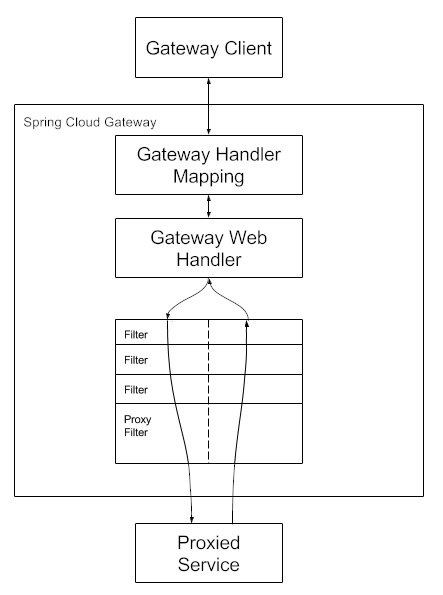

# Gateway 网关

## 1. 路由

### 1.1 规则配置

**配置项**

```java
@Validated
public class RouteDefinition {

	private String id;

	@NotEmpty
	@Valid
	private List<PredicateDefinition> predicates = new ArrayList<>();

	@Valid
	private List<FilterDefinition> filters = new ArrayList<>();

	@NotNull
	private URI uri;

	private Map<String, Object> metadata = new HashMap<>();

	private int order = 0; // 数字越小优先级越高
    
    // ...
}
```

**yml 配置**

```yaml
spring:
  cloud:
    gateway:
      routes:
        - id: order-route
          uri: lb://service-order
          predicates:
            - Path=/api/order/**
        - id: product-route
          uri: lb://service-product
          predicates:
            - Path=/api/product/**
```

### 1.2 工作原理



## 2. 断言

### 2.1 断言工厂

Spring Cloud Gateway 内置多种断言工厂，配置断言提供长短写法，短写法通过位置参数绑定到断言工厂的配置类 `Config`，长写法是通过显式指定参数名的方式绑定，不同断言工厂配置类设置的参数不同。

```yaml
spring:
  cloud:
    gateway:
      routes:
        - id: test_route
          uri: http://example.org
          predicates:
            - Header=X-Token, .+
            
spring:
  cloud:
    gateway:
      routes:
        - id: test_route
          uri: http://example.org
          predicates:
            - name: Header
              args:
                header: X-Token
                regexp: .+    
```

### 2.2 自定义断言工厂

工厂名 `xxxRoutePredicateFactory` 会自动注册成 `xxx`

```java
@Component
public class MyCustomRoutePredicateFactory extends AbstractRoutePredicateFactory<VipRoutePredicateFactory.Config> {

    public MyCustomRoutePredicateFactory() {
        super(Config.class);
    }

    @Override
    public Predicate<ServerWebExchange> apply(Config config) {
        return new GatewayPredicate() {
            @Override
            public boolean test(ServerWebExchange serverWebExchange) {
                ServerHttpRequest request = serverWebExchange.getRequest();
                String first = request.getQueryParams().getFirst(config.param);
                return StringUtils.hasText(first) && first.equals(config.value);
            }
        };
    }

    @Override
    public List<String> shortcutFieldOrder() {
        return Arrays.asList("param", "value");
    }

    @Validated
    @Data
    public static class Config {
        @NotEmpty
        private String param;

        @NotEmpty
        private String value;
    }
}
```

```yaml
spring:
  cloud:
    gateway:
      routes:
        - id: custom_route
          uri: http://localhost:8888
          predicates:
            - MyCustom=user,jack
```

## 3. 过滤器

### 3.1 过滤器工厂

Spring Cloud Gateway 内置多种过滤器工厂

### 3.2 默认过滤器

使用 `spring.cloud.gateway.default-filters` 为所有路由添加默认的过滤器

### 3.3 全局过滤器

```java
@Slf4j
@Component
public class CustomGlobalFilter implements GlobalFilter, Ordered {
    // 响应式异步
    @Override
    public Mono<Void> filter(ServerWebExchange exchange, GatewayFilterChain chain) {
        log.info("custom global filter");
        String uri = exchange.getRequest().getURI().getPath();
        long startTime = System.currentTimeMillis();
        return chain.filter(exchange).doFinally(s -> {
            long endTime = System.currentTimeMillis();
            log.info("request: {}, custom global filter time: {}", uri, endTime - startTime);
        });
    }

    @Override
    public int getOrder() {
        return -1;
    }
}
```

### 3.4 自定义过滤器工厂

工厂名 `xxxRoutePredicateFactory` 会自动注册成 `xxx`

```java
@Component
public class TokenGatewayFilterFactory extends AbstractNameValueGatewayFilterFactory {
    @Override
    public GatewayFilter apply(NameValueConfig config) {
        return new GatewayFilter() {

            @Override
            public Mono<Void> filter(ServerWebExchange exchange, GatewayFilterChain chain) {
                return chain.filter(exchange).then(Mono.fromRunnable(() -> {
                    ServerHttpResponse response = exchange.getResponse();
                    HttpHeaders headers = response.getHeaders();
                    String value = config.getValue();

                    if ("uuid".equals(value)) {
                        value = UUID.randomUUID().toString();
                    }

                    headers.add(config.getName(), value);
                }));
            }
        };
    }
}
```

```yaml
spring:
  cloud:
    gateway:
      routes:
        - id: product-route
          uri: lb://service-product
          predicates:
            - Path=/api/product/**
          filters:
            - Token=X-Response-Token, uuid
```

## 4. 全局跨域

```yaml
spring:
  cloud:
    gateway:
      globalcors:
        cors-configurations:
          '[/**]':
            allowed-origin-patterns: '*'
            allowed-headers: '*'
            allowed-methods: '*'
```

## 面试题

### 1. 微服务之间的调用经过网关吗

微服务之间的调用一般不经过网关，但是网关也是一个微服务，服务器可以直接请求网关来调用目标微服务，从而经过网关。
