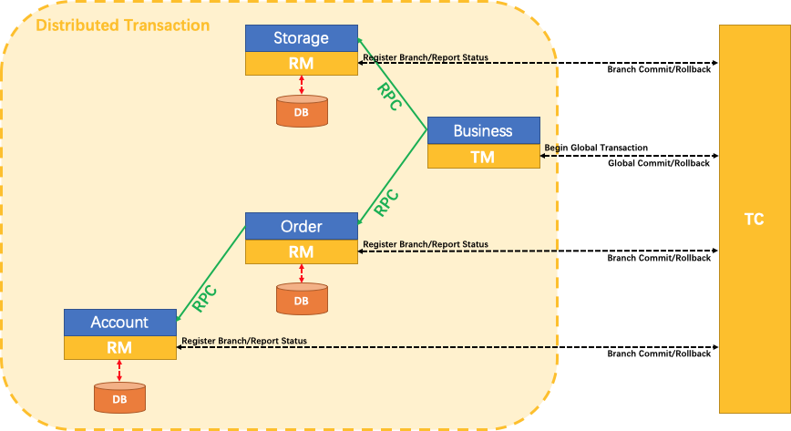

# Seata

## 1. 架构原理

**TC (Transaction Coordinator) 事务协调者**

维护全局和分支事务的状态，驱动全局事务提交或回滚。

**TM (Transaction Manager) 事务管理器**

定义全局事务的范围：开始全局事务、提交或回滚全局事务。

**RM(Resource Manager) 资源管理器**

管理分支事务处理的资源，与 TC 交谈以注册分支事务和报告分支事务的状态，并驱动分支事务提交或回滚。

## 2. 二阶段锁协议

**二阶段锁协议（Two-Phase Locking，2PL）**，常见并发控制机制，用于保证事务的可串行化，一般用于单节点并发控制协议。

### 2.1 加锁阶段（Growing Phase）

事务可以申请新的锁（读/写锁，加锁操作在读/写数据之前完成），不能释放任何已经持有的锁

### 2.2 解锁阶段（Shrinking Phase）

事务释放了任意一个锁，不能再申请新锁

## 3. 二阶段提交协议

二阶段提交协议（**Two-Phase Commit Protocol，2PC**）是一种分布式事务一致性协议，用于确保多个参与节点在一个事务中 **要么全部提交，要么全部回滚**，一般用于解决跨节点一致性协议。

### 3.1 准备阶段（Prepare）

1. 协调者向所有参与者发送 **prepare 请求**

2. 每个参与者执行以下操作：

   1. 进行本地事务的预执行（不提交）

   2. 写入 **undo log / redo log**，确保可以回滚或恢复

   3. 如果执行成功，返回 **Yes** 给协调者；如果失败，返回 **No**

3. 协调者收集所有参与者的响应

### 3.2 提交阶段（Commit）

1. 响应全为 **Yes**
   1. 协调者向所有参与者发送 **commit 请求**
   2. 参与者提交本地事务并释放资源
   3. 向协调者返回提交成功的确认
2. 响应全为 **No** 或 **超时**
   1. 协调者向所有参与者发送 **rollback 请求**
   2. 各参与者根据 undo log 回滚
   3. 返回回滚确认

## 4. 四种事物模式

### 4.1 Seata AT 模式

### 4.2 Seata TCC 模式

### 4.3 Seata Saga 模式

### 4.4 Seata XA 模式