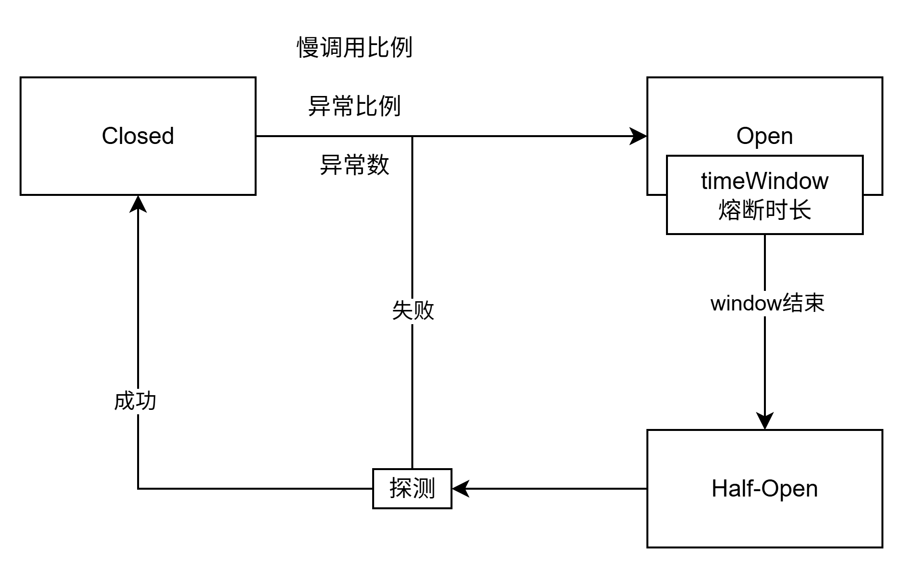

# Sentinel

> 面向分布式、多语言异构化服务架构的流量治理组件。

## 1. 工作原理

1. 定义资源（编程式 `SphU API`，声明式 `@SentinelResource`）
2. 定义规则
3. 检验规则是否生效

## 2. 异常处理

### 2.1 Web接口

#### 2.1.1 运行流程

`SentinelWebInterceptor` 继承自 `AbstractSentinelInterceptor` ，在 `preHandle` 方法中默认使用 `DefaultBlockExceptionHandler` 来处理异常。

```java
public abstract class AbstractSentinelInterceptor implements HandlerInterceptor {
	// ...
    
    @Override
    public boolean preHandle(HttpServletRequest request, HttpServletResponse response, Object handler)
            throws Exception {
        String resourceName = "";
        try {
            resourceName = getResourceName(request);
            if (StringUtil.isEmpty(resourceName)) {
                return true;
            }
            if (increaseReference(request, this.baseWebMvcConfig.getRequestRefName(), 1) != 1) {
                return true;
            }
            // Parse the request origin using registered origin parser.
            String origin = parseOrigin(request);
            String contextName = getContextName(request);
            ContextUtil.enter(contextName, origin);
            Entry entry = SphU.entry(resourceName, ResourceTypeConstants.COMMON_WEB, EntryType.IN);
            request.setAttribute(baseWebMvcConfig.getRequestAttributeName(), entry);
            return true;
        } catch (BlockException e) {
            try {
                handleBlockException(request, response, resourceName, e); // 处理异常
            } finally {
                ContextUtil.exit();
            }
            return false;
        }
    }
    
    // ...
}
```

#### 2.1.2 自定义 BlockExceptionHandler

```java
@Component
public class MyBlockExceptionHandler implements BlockExceptionHandler {
    @Override
    public void handle(HttpServletRequest request, HttpServletResponse response, String resourceName, BlockException e) throws Exception {
        response.setContentType("application/json;charset=utf-8");
        PrintWriter writer = response.getWriter();

        Result result = Result.error(500, resourceName + ":" + e.getClass());

        writer.write(JSON.toJSONString(result));

        writer.flush();
        writer.close();
    }
}
```

### 2.2 @SentinelResource

#### 2.2.1 运行流程

优先走 `blockhandler`，`blockhandler` 未配置则走 `fallback`，`fallback` 未配置则走 `default fallback`， `default fallback` 未配置则向上抛出异常。

```java
@Aspect
public class SentinelResourceAspect extends AbstractSentinelAspectSupport {
	// 切入注解
    @Pointcut("@annotation(com.alibaba.csp.sentinel.annotation.SentinelResource)")
    public void sentinelResourceAnnotationPointcut() {
    }

    @Around("sentinelResourceAnnotationPointcut()")
    public Object invokeResourceWithSentinel(ProceedingJoinPoint pjp) throws Throwable {
        Method originMethod = resolveMethod(pjp);

        SentinelResource annotation = originMethod.getAnnotation(SentinelResource.class);
        if (annotation == null) {
            // Should not go through here.
            throw new IllegalStateException("Wrong state for SentinelResource annotation");
        }
        String resourceName = getResourceName(annotation.value(), originMethod);
        EntryType entryType = annotation.entryType();
        int resourceType = annotation.resourceType();
        Entry entry = null;
        try {
            // 资源保护
            entry = SphU.entry(resourceName, resourceType, entryType, pjp.getArgs());
            return pjp.proceed();
        } catch (BlockException ex) {
            return handleBlockException(pjp, annotation, ex);
        } catch (Throwable ex) {
            Class<? extends Throwable>[] exceptionsToIgnore = annotation.exceptionsToIgnore();
            // The ignore list will be checked first.
            if (exceptionsToIgnore.length > 0 && exceptionBelongsTo(ex, exceptionsToIgnore)) {
                throw ex;
            }
            if (exceptionBelongsTo(ex, annotation.exceptionsToTrace())) {
                traceException(ex);
                return handleFallback(pjp, annotation, ex);
            }

            // No fallback function can handle the exception, so throw it out.
            throw ex;
        } finally {
            if (entry != null) {
                entry.exit(1, pjp.getArgs());
            }
        }
    }
}

protected Object handleBlockException(ProceedingJoinPoint pjp, SentinelResource annotation, BlockException ex)
    throws Throwable {

    // 优先走 blockhandler
    Method blockHandlerMethod = extractBlockHandlerMethod(pjp, annotation.blockHandler(),
        annotation.blockHandlerClass());
    if (blockHandlerMethod != null) {
        Object[] originArgs = pjp.getArgs();
        // Construct args.
        Object[] args = Arrays.copyOf(originArgs, originArgs.length + 1);
        args[args.length - 1] = ex;
        return invoke(pjp, blockHandlerMethod, args);
    }

    // 未配置 blockhandler, 走 fallback
    return handleFallback(pjp, annotation, ex);
}

protected Object handleFallback(ProceedingJoinPoint pjp, String fallback, String defaultFallback,
                                Class<?>[] fallbackClass, Throwable ex) throws Throwable {
    Object[] originArgs = pjp.getArgs();

    // 优先走 fallback
    Method fallbackMethod = extractFallbackMethod(pjp, fallback, fallbackClass);
    if (fallbackMethod != null) {
        // Construct args.
        int paramCount = fallbackMethod.getParameterTypes().length;
        Object[] args;
        if (paramCount == originArgs.length) {
            args = originArgs;
        } else {
            args = Arrays.copyOf(originArgs, originArgs.length + 1);
            args[args.length - 1] = ex;
        }

        return invoke(pjp, fallbackMethod, args);
    }
    
    // 未配置 fallback, 走 default fallback
    return handleDefaultFallback(pjp, defaultFallback, fallbackClass, ex);
}

protected Object handleDefaultFallback(ProceedingJoinPoint pjp, String defaultFallback,
                                       Class<?>[] fallbackClass, Throwable ex) throws Throwable {
    // 优先走 default fallback
    Method fallbackMethod = extractDefaultFallbackMethod(pjp, defaultFallback, fallbackClass);
    if (fallbackMethod != null) {
        // Construct args.
        Object[] args = fallbackMethod.getParameterTypes().length == 0 ? new Object[0] : new Object[] {ex};
        return invoke(pjp, fallbackMethod, args);
    }

    // 未配置 default fallback, 向上级抛出异常
    throw ex;
}
```

#### 2.2.2 自定义 blockHandler

```java
@SentinelResource(value = "createOrder", blockHandler = "createOrderFallback")
@Override
public Order createOrder(Long productId, Long userId) {
    Product product = productFeignClient.getProduct(productId);
    Order order = new Order();
    order.setId(1L);

    order.setTotalAmount(product.getPrice().multiply(new BigDecimal(product.getNum())));
    order.setUserId(userId);
    order.setNickName("jack");
    order.setAddress("cn");

    order.setProductList(Arrays.asList(product));
    return order;
}

public Order createOrderFallback(Long productId, Long userId, BlockException exception) {
    Order order = new Order();
    order.setId(0L);
    order.setTotalAmount(new BigDecimal("0"));
    order.setUserId(userId);
    return order;
}
```

### 2.3 OpenFeign 调用

使用 `@FeignClient` 设置 `fallback`。

```java
@SentinelResource(value = "createOrder", fallback = "createOrderFallback")
@Override
public Order createOrder(Long productId, Long userId) {
    Product product = productFeignClient.getProduct(productId);
    Order order = new Order();
    order.setId(1L);

    order.setTotalAmount(product.getPrice().multiply(new BigDecimal(product.getNum())));
    order.setUserId(userId);
    order.setNickName("jack");
    order.setAddress("cn");

    order.setProductList(Arrays.asList(product));
    return order;
}

// fallback 使用 Throwable, 如果使用 BlockException, 会走 blockHandler 该方法不会调用
public Order createOrderFallback(Long productId, Long userId, Throwable exception) {
    Order order = new Order();
    order.setId(0L);
    order.setTotalAmount(new BigDecimal("0"));
    order.setUserId(userId);
    return order;
}
```

```java
@Configuration(proxyBeanMethods = false)
@ConditionalOnClass({ SphU.class, Feign.class })
public class SentinelFeignAutoConfiguration {

	@Bean
	@Scope("prototype")
	@ConditionalOnMissingBean
	@ConditionalOnProperty(name = "feign.sentinel.enabled")
	public Feign.Builder feignSentinelBuilder() {
		return SentinelFeign.builder();
	}

}
```

```java
public final class SentinelFeign {

	private static final String FEIGN_LAZY_ATTR_RESOLUTION = "spring.cloud.openfeign.lazy-attributes-resolution";

	private SentinelFeign() {

	}

	public static Builder builder() {
		return new Builder();
	}

	public static final class Builder extends Feign.Builder
			implements ApplicationContextAware {

		private Contract contract = new Contract.Default();

		private ApplicationContext applicationContext;

		private FeignClientFactory feignClientFactory;

		@Override
		public Feign.Builder invocationHandlerFactory(
				InvocationHandlerFactory invocationHandlerFactory) {
			throw new UnsupportedOperationException();
		}

		@Override
		public Builder contract(Contract contract) {
			this.contract = contract;
			return this;
		}

		@Override
		public Feign internalBuild() {
			super.invocationHandlerFactory(new InvocationHandlerFactory() {
				@Override
				public InvocationHandler create(Target target,
						Map<Method, MethodHandler> dispatch) {
					GenericApplicationContext gctx = (GenericApplicationContext) Builder.this.applicationContext;
					BeanDefinition def = gctx.getBeanDefinition(target.type().getName());
					FeignClientFactoryBean feignClientFactoryBean;

					// If you need the attributes to be resolved lazily, set the property value to true.
					Boolean isLazyInit = applicationContext.getEnvironment()
							.getProperty(FEIGN_LAZY_ATTR_RESOLUTION, Boolean.class, false);
					if (isLazyInit) {
						/*
						 * Due to the change of the initialization sequence,
						 * BeanFactory.getBean will cause a circular dependency. So
						 * FeignClientFactoryBean can only be obtained from BeanDefinition
						 */
						feignClientFactoryBean = (FeignClientFactoryBean) def
								.getAttribute("feignClientsRegistrarFactoryBean");
					}
					else {
						feignClientFactoryBean = (FeignClientFactoryBean) applicationContext
								.getBean("&" + target.type().getName());
					}
					Class fallback = feignClientFactoryBean.getFallback();
					Class fallbackFactory = feignClientFactoryBean.getFallbackFactory();
					String beanName = feignClientFactoryBean.getContextId();
					if (!StringUtils.hasText(beanName)) {
						beanName = (String) getFieldValue(feignClientFactoryBean, "name");
					}

					Object fallbackInstance;
					FallbackFactory fallbackFactoryInstance;
					// check fallback and fallbackFactory properties
					if (void.class != fallback) {
						fallbackInstance = getFromContext(beanName, "fallback", fallback,
								target.type());
						return new SentinelInvocationHandler(target, dispatch,
								new FallbackFactory.Default(fallbackInstance));
					}
					if (void.class != fallbackFactory) {
						fallbackFactoryInstance = (FallbackFactory) getFromContext(
								beanName, "fallbackFactory", fallbackFactory,
								FallbackFactory.class);
						return new SentinelInvocationHandler(target, dispatch,
								fallbackFactoryInstance);
					}

					return new SentinelInvocationHandler(target, dispatch);
				}

				private Object getFromContext(String name, String type,
						Class fallbackType, Class targetType) {
					Object fallbackInstance = feignClientFactory.getInstance(name,
							fallbackType);
					if (fallbackInstance == null) {
						throw new IllegalStateException(String.format(
								"No %s instance of type %s found for feign client %s",
								type, fallbackType, name));
					}
					// when fallback is a FactoryBean, should determine the type of instance
					if (fallbackInstance instanceof FactoryBean<?> factoryBean) {
						try {
							fallbackInstance = factoryBean.getObject();
						}
						catch (Exception e) {
							throw new IllegalStateException(type + " create fail", e);
						}
						fallbackType = fallbackInstance.getClass();
					}

					if (!targetType.isAssignableFrom(fallbackType)) {
						throw new IllegalStateException(String.format(
								"Incompatible %s instance. Fallback/fallbackFactory of type %s is not assignable to %s for feign client %s",
								type, fallbackType, targetType, name));
					}
					return fallbackInstance;
				}
			});

			super.contract(new SentinelContractHolder(contract));
			return super.internalBuild();
		}

		private Object getFieldValue(Object instance, String fieldName) {
			Field field = ReflectionUtils.findField(instance.getClass(), fieldName);
			field.setAccessible(true);
			try {
				return field.get(instance);
			}
			catch (IllegalAccessException e) {
				// ignore
			}
			return null;
		}

		@Override
		public void setApplicationContext(ApplicationContext applicationContext)
				throws BeansException {
			this.applicationContext = applicationContext;
			feignClientFactory = this.applicationContext.getBean(FeignClientFactory.class);
		}

	}

}
```

### 2.4 SphU 硬编码

```java
try {
    SphU.entry("resource-name");
    // 业务逻辑
} catch (BlockException e) {
    // 处理逻辑
}
```

## 3. 流控规则

### 3.1 阈值类型

**QPS**

统计每秒请求数（性能高）。

**并发线程数**

统计并发线程数。

### 3.2 流控模式

**直接**

直接限制某个资源的请求。

**链路**

限制某个资源指定链路过来的请求（限制上游），注意关闭上下文统一 `web-context-unify` 。

**关联**

监听某个资源关联的请求，关联请求较大时，限制自身的请求。

### 3.3 流控效果

**快速失败**

超过阈值立即拒绝请求。

**Warm Up**

启动时逐步增加流量阈值。

**排队等待**

以 ms 为单位，精度不支持 QPS > 1000，控制请求以固定速率通过，多余的请求会排队等待，超出等待时间被丢弃。

## 4. 熔断规则

> best practice: 熔断降级作为保护自身的手段，通常在客户端（调用端）进行配置。 



### 4.1 熔断策略

**慢调用比例**

统计时间窗口慢调用比例，超过设定的阈值触发熔断

**异常比例**

统计时间窗口内的请求异常比例

**常函数**

统计时间窗口内的异常请求数

## 5. 热点规则

